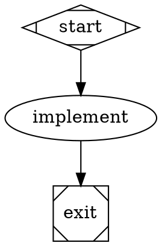

# The Fabro dialect, as lowered

Petri runs Fabro workflows: Graphviz DOT files (`*.fabro`, `*.dot`) in the
subset Fabro accepts. This page says what each Fabro construct becomes in the
engine's IR, and what is refused. Fabro's own documentation defines the
language; `.ai/plans/done/fabro-frontend-phase-one.md` records the decisions.
The reference Fabro revision, the required workflow bundles, the feature
matrix, and the accepted differences are frozen in
[`crates/fabro/acceptance/CONTRACT.md`](acceptance/CONTRACT.md).

The rule throughout: **every construct lowers onto what the core has**. No
engine semantics were added for Fabro. A construct that cannot lower is a
specific `unsupported.*` rejection, never a silent approximation.

## Run creation happens at load

Fabro renders templates, resolves `@file` references and applies its model
stylesheet once, when a run is created, and persists the literal graph. The
frontend does the same at load, so `petri check --print-graph` shows the graph
a run will execute.

| Fabro | At load |
|---|---|
| `{{ inputs.* }}`, `{{ vars.* }}`, `{{ goal }}` in the goal and prompts | rendered with MiniJinja, strict: an unbound name is `unsupported.template.unbound_input` with the `--input KEY=VALUE` hint. `petri check` given no inputs at all downgrades it to the warning `fabro.unbound_input` and leaves the text unrendered, so a file validates before its inputs exist; a run is always strict |
| the same tokens in a `script` | Fabro's token interpolation: each token is one shell-quoted word |
| `[run.inputs]` in `workflow.toml` beside the file | input defaults, under the host's `--input` / `--inputs-file` |
| other sections in `workflow.toml` | every section is diagnosed, none is dropped silently. Platform-only or not-yet-applied sections warn `ignored.workflow_toml.<section>` with why (`[run.goal]`, `[run.working_dir]`, `[run.metadata]`, `[run.execution]`, `[run.model]` and `[run.model.fallbacks]`, `[run.environment]`, `[run.clone]`, `[run.run_branch]`, `[run.meta_branch]`, `[run.pull_request]`, `[run.git]`, `[run.integrations]`, `[run.checkpoint]`, `[run.artifacts]`, `[run.notifications]`, `[run.interviews]`, `[run.scm]`, `[run.agent] fabro_tools`, and the top-level `[project]`, `[environments]`, `[cli]`, `[server]`, `[llm]`). A requirement the standalone runner cannot meet is an error: `unsupported.workflow_toml.run.prepare` (setup steps would be skipped), `unsupported.workflow_toml.run.hooks` (a configured hook is never skipped silently), `unsupported.workflow_toml.run.agent.mcps`. A key Fabro's parser refuses (a legacy top-level key, an unknown `[run]` key, `_version` other than 1) is `unsupported.workflow_toml.key` / `unsupported.workflow_toml.version` with Fabro's rename hint. See `crates/fabro/acceptance/CONTRACT.md` for the per-option table |
| `prompt="@prompts/x.md"`, `output_schema="@schemas/x.json"` | read beside the workflow file; `` resolves beside the included file |
| `model_stylesheet` | rendered, parsed (`*`, shape, `.class`, `#id`; specificity 0–3), written onto nodes; an explicit node attribute wins |
| `import` | `unsupported.import` (later phase) |

Inputs, vars and the rendered goal land in `Graph.params` (`inputs`, `vars`,
`goal`), so the persisted graph is self-describing for replay.

## Nodes

| Shape / type | Petri node | Step config |
|---|---|---|
| `Mdiamond` start | `noop`, the entry | |
| `Msquare` exit | `noop`; `Completion::TerminalNode(exit)` | |
| `diamond` conditional | `noop` | |
| `box` agent, `tab` prompt | `fabro/agent` | prompt, goal, fidelity, `backend`, model settings, `output_schema`, `output_retries`, `acp` |
| `parallelogram` command, or any node with `script` | `fabro/command` | script, language, `stdin` (an expression over `kv`), `output_schema` |
| `hexagon` human | `fabro/human` | the choices (from the edges), `question_type`, `freeform_target`, `sensitive`, `review_target`, `default_choice` (from `human.default_choice`), `timeout_ms` |
| `component` parallel | `noop` with one routing group per branch, or a `for_each` expansion (below) | |
| `tripleoctagon` fan-in | `noop`, `join: all`; its output is the ordered branch results | |
| `insulator` wait | `fabro/wait` | `duration_ms` |
| `house` manager loop | `fabro/workflow` | the child graph's digest, `manager.*` |
| `circle`, `doublecircle`, other shapes | `fabro/agent`, with a `fabro.unknown_shape` warning | |

Every node's `meta` carries `label`, `shape`, `kind`, `classes`, `span`, and
`model` / `provider` / `reasoning_effort` when set. Every step config carries
`kv` (the run context at spawn) and `on_failure`.

Timeouts: `timeout` is the per-attempt `Budget.timeout`. Without one, a
command gets 600 s (Fabro's default), an agent 24 h, a human gate 30 days, a
wait its duration plus an hour. A bare number (`timeout=1200`) is the
Attractor spelling and is refused; write the unit.

Who enforces the timeout follows Fabro's handler policies
(`Budget.timeout_policy`). A command, a human gate and an ACP agent are
`HandlerManaged`: the command sends its deadline to the sandbox (`timeout_ms`
in the step config, 600 s by default) and fails with `Script timed out after
Nms` and class `timeout`; the human gate's timeout is its answer deadline (see
"Steps at run time"); the ACP agent hands the deadline to its turn. The
driver arms no timer of its own around those steps, so a human gate's 30 day
default is not an answer deadline. Every other node, including a native
`backend="api"` agent and a `tab` prompt on it, is `ExecutorEnforced`: the
driver's timer counts active work only, stops while the step has a question
pending with the host, and resumes with the remaining time when the last
pending question is answered. A sibling's question never extends another
stage's budget. On expiry the driver cancels the step (for a native agent,
through Pebble's prompt cancellation token; Pebble's own wall-clock timer stays
unset). The attempt is `timed_out` and a retry gets a fresh budget.

Run policies: `stall_timeout` (default 30 m; `0s` disables) is the stall
watchdog's budget, and `loop_restart_signature_limit` (default 3, at least 1)
is the failure circuit breaker's limit. Both lower to the graph's
`RunPolicy`; the host enforces them (see "Watchdog and circuit breaker").

Retries: `max_retries` (default `default_max_retries`, default 0) or a
`retry_policy` preset (`none`, `standard`, `aggressive`, `linear`, `patient`)
becomes `RetryPolicy`. Only a failure the step classed `retry_requested` is
retried: Fabro's retry intent is a flag on the outcome, never a status.
`allow_partial=true` — Fabro's spelling of `on_retries_exhausted="partially_succeed"` —
is `Exhaustion::AcceptPartial`.

## Routing

Each node's outgoing edges become one routing group with `SelectionPolicy::Tiered`
and Fabro's four tiers, `Fallthrough::NoEmit` (no match is a normal end):

| Tier | Candidates | `when` | pick |
|---|---|---|---|
| 1 | edges with a `condition` | the lowered condition | `selection`: `HighestWeightThenLexical` (default) or `WeightedRandom` |
| 2 | unconditional edges with a `label` | `normalize_label(output.preferred_label) == "<label key>"` | `First` |
| 3 | unconditional edges | `index_of(output.suggested_next_ids, "<target>") != null`, ranked by that index | `LowestRankThenArmOrder` |
| 4 | unconditional edges | the failure policy (below) | `selection` |

Weights are Fabro's: highest wins, ties break on the lexical target id, and a
negative `weight` deprioritizes an edge. The engine's weights are unsigned, so a
node with a negative weight has every weight shifted up until the lowest is
zero (order and ties unchanged). Under `selection="random"` a weight at or below
zero counts as one, as Fabro counts it.

Labels: the accelerator prefix (`[Y] Yes`, `Y) Yes`, `Y - Yes`) is stripped on
both sides before the engine's `normalize_label`. `selection="random"` with a
conditional edge is `fabro.random_with_conditions`, as in Fabro. `loop_restart=true`
is `EdgeTransition::Restart`: the execution ends and a successor starts at the
target with empty context.

### Conditions

| Fabro | Petri expression |
|---|---|
| `outcome=succeeded` / `partially_succeeded` / `skipped` | `status == 'success'` / `'partial_success'` / `'skipped'` |
| `outcome=failed` | `failure() || cancelled() || timed_out()` |
| `outcome=success` | read as `outcome=succeeded` with the warning `deprecated.outcome_alias`, until 2026-10-04 (Fabro itself never matches it) |
| `outcome=<anything else>` | `unsupported.outcome_value`: domain signals ride `context_updates` |
| `preferred_label=X` | `to_string(default(output.preferred_label, '')) == 'X'` |
| `context.K=X`, bare `K=X` | `to_string(default(get(kv, 'K'), '')) == 'X'` — Fabro's text comparison |
| `K` (bare) | non-empty, not `"false"`, not `"0"` |
| `K > 5` and friends | both sides numeric, else false (`loose_*` builtins) |
| `K contains X` | array element equality, else substring |
| `K matches re` | `matches(...)`; the pattern is validated at load |

### Failure policy

Two attributes, one value set — `route`, `exit`, `partially_succeed` — and the
specific one wins:

- `on_failure` decides a non-retryable failure; `on_retries_exhausted` decides a
  retryable one that ran out of attempts (`allow_partial=true` spells the latter's
  `partially_succeed`).
- `route`: the unconditional edge is taken. `exit`: it is guarded `!failed`, so
  the run quiesces and fails under `TerminalNode`. `partially_succeed`: the step
  classifies the failure as `PartialSuccess` (failure kept in `underlying`) and it
  routes as a success.
- A human gate never falls through on failure, whatever the policy.
- `on_failure="succeed"` (and `auto_status=true`, its deprecated spelling) is a
  30-day compatibility shim, accepted until **2026-10-04** with the warning
  `deprecated.on_failure.succeed` / `deprecated.auto_status`. It lowers like
  `partially_succeed` with one difference at the step boundary: the step keeps
  the failure on its record as a `PartialSuccess`, but reports
  `output.outcome = "succeeded"`, and the node's `outcome=succeeded` conditions
  match that converted failure while `outcome=partially_succeeded` does not — what
  Fabro shows its conditions. The event log never records a clean success for a
  failed step. After the sunset both spellings are refused again
  (`unsupported.on_failure.succeed`, `unsupported.auto_status`); rewrite the
  workflow to `partially_succeed` first.

**Deliberate departure (tracked defect, owned by task 7 of
`.ai/plans/fabro-unified-task-list.md`).** Fabro promotes a failed outcome only
when no explicit route matches, so an `outcome=failed` edge on a `succeed` node
is still taken. Petri classifies once, at the step boundary, before routing sees
the outcome; an `outcome=failed` edge on a `partially_succeed` node is
unreachable and gets the `fabro.unreachable_failure_edge` lint. The pinned
Fabro's validator also refuses the `partially_succeed` spelling itself (its
`on_failure_valid` rule accepts `route`, `exit`, `succeed`), so the oracle
case `partially_succeed_policy_classifies_before_routing` records a Fabro
rejection beside Petri's result. The compatibility contract in
`crates/fabro/acceptance/CONTRACT.md` lists this and the parallel-context
departure as the two differences to retire.

### Goal gates and loops

`goal_gate=true` nodes lower to a `goal_check` noop in front of `exit`: for each
gate (in id order) an arm guarded by `!default(nodes.<gate>.success_like, false)`
jumps back to the first existing retry target of the node's `retry_target`, its
`fallback_retry_target`, the graph's, the graph's fallback; a gate with no target
ends the run failed; the last arm reaches `exit` when every gate passed.

A depth-first search from start marks every cycle-closing edge `back`; every
node forward-reachable from a back edge's target gets a finite
`Budget.max_firings`: `max_visits`, else `max_node_visits`, else 500 (Fabro's
unlimited, with one `info.budget.default` note). A value above 500 is refused.
Every node except a fan-in joins with `Any`.

## Parallel

A `component` node without `for_each` fans out with one routing group per
branch; every branch's edge into the `tripleoctagon` carries
`{ index, value: { id, status, output } }`, and the fan-in's output is those
values in branch order. `for_each="context.K"` makes the component evaluate
`get(kv, 'K')` (its precondition enforces Fabro's 1000-item cap) and marks the
single template node — an agent or prompt — with `Expansion::ForEach` over its
input, `max_parallel` carried, `fail_fast: false`. Branch results ride tokens;
`stdin_source="context.parallel.results"` on a later command reads the nearest
fan-in's output.

## Nested workflows

`stack.child_workflow` (a path; `fabro/…` stands for `.fabro/…`) or
`stack.child_dot_source` (inline DOT) is lowered with the parent, to at most
three levels, with cycles refused. The child graph is registered before the
run starts, and the `fabro/workflow` step invokes it by digest through the
coordinator, once per cycle up to `manager.max_cycles`, until
`manager.stop_condition` holds over the child's final context. The child
inherits the parent's sandbox and secrets; the parent's cancel cancels it.

## Steps at run time

- **`fabro/command`** runs the script in bash (`language="python"`: `python3 -c`)
  with stderr merged, feeds `stdin_source` through the process's stdin, keeps
  the last 64 KiB of output in `output.stdout` and `command.output`, and with
  `output_schema="routing"` reads the last JSON object of the output as the
  routing directive (`outcome`, `preferred_next_label`, `suggested_next_ids`,
  `context_updates`, `failure_reason`).
- **`fabro/agent`** assembles the prompt from the goal, earlier stages, and the
  node's prompt. Both backends share routing, `output_schema` validation,
  `output_retries` repair turns, and steering deliveries. Each attempt starts a
  fresh agent session. Repair turns keep that session's history.
  `backend="acp"` is the default. It starts the Agent Client Protocol command
  from `acp.command` / `acp.config` (node, graph, then `PETRI_ACP_COMMAND`). The
  ACP command owns model selection; model settings are observer metadata.
  `backend="api"` runs the Pebble Rust library in Petri. `model` (or graph
  `default_model`) is required. `provider` (or `default_provider`) qualifies the
  model selector, and `reasoning_effort` configures the actual model request.
  The node's backend overrides the graph's backend; model stylesheets can also
  select it. Graph ACP configuration applies only to ACP nodes. Setting ACP
  options directly on an API node is an error.
- **`fabro/human`** asks through the core `Question` event and routes on the
  delivered answer. The host's interviewer answers: `petri run --interactive`
  from the terminal, `--auto-approve` with the first choice,
  `--interview-script <file>` from a script (see the README's terminal path
  section). A `question_type="multi_select"` answer names several choices
  (`Answer::choices`, the `option_keys` of Fabro's `multi_selected` answer);
  the first routes, and `human.gate.selected` / `human.gate.label` record every
  selected key and label joined by `,` and `, `, as Fabro does. Every answered
  gate also records `human.gate.<node>.question`, `.answer` and `.label`. A
  `sensitive=true` gate's free text crosses as a `$secret` reference, which is
  a Petri extension. An answer marked `cancelled` (the interviewer failed, or
  the wait was cancelled) fails the gate closed with class `interrupted`. A
  delivered steer (`{"$steer": ...}`) is not an answer: the gate ignores it
  and keeps its question open.
  - `timeout` is the answer deadline. An unanswered question expires in the
    step: with `human.default_choice="<target or key>"` the gate takes that
    choice and records `timeout` as the answer; without one it fails with
    Fabro's retry outcome (class `retry_requested`), so `max_retries` asks
    again and `on_retries_exhausted` decides after that. The question carries
    `timeout_ms` so a host can show the deadline.
  - `review_target=true` reads `review_target` from the run context
    (`{"label", "url", "kind"}`, as an earlier stage's `context_updates`
    wrote it), validates it as Fabro does (a non-empty label of at most 200
    characters, an absolute `http`/`https` URL of at most 2048 characters with
    a host and no credentials or `<>|` characters), asks Fabro's sentence
    `Review the <label> <kind>, then choose the next action.` with the
    reference attached to the question, and logs `review: <label> <url>`. A
    missing or invalid target fails the gate before anyone is asked, with
    Fabro's message and class `review_target`; the refused URL is never
    repeated.
- **`fabro/wait`** sleeps, cancel-aware.
- **`fabro/workflow`** is the nested invocation above.
- **`petri run --dry-run`** is the stub registry: every stage succeeds, a human
  gate takes its first choice, as Fabro's `--dry-run` does.

## Native Pebble

The `petri` distribution supplies a lithos-llm client with the built-in model
catalog and environment credentials, such as `ANTHROPIC_API_KEY` or
`OPENAI_API_KEY`. It enables Anthropic, OpenAI, Gemini, and OpenAI-compatible
adapters. Applications that use `fabro_steps::register` directly must provide
`fabro_steps::pebble::PebbleClient(client)` through `Runtime::capability`.
The application owns the client's catalog, credentials, and retry middleware.

Tools use the firing's `ExecEnv`. Commands run as `bash -c` inside the scope;
files use the scope's filesystem. Bash, find, grep, and the usual file utilities
must be available there. Content search uses ripgrep when available and grep
otherwise. Searches fail explicitly when their captured output exceeds 4 MiB.
The backend reads workspace `AGENTS.md` and discovers workspace skills in
`.agents/skills` and `.pebble/skills`. Tools have full access within the scope's
policy. Petri's sandbox owns process isolation. This integration does not
install interactive approvals or subagents. Tool output is bounded by Pebble's
capture and preview limits. Omitted bytes are discarded and cannot be retrieved.

`Control::Deliver` accepts a string or `{ "text": "..." }` and queues a
follow-up. A delivered core `Answer` naming one of the session's open
questions answers it instead (below). Cancellation settles the active prompt
and shuts down its session.
Kill stops active tool processes immediately. A driver hard abort can discard
an unsettled prompt report; scope release remains responsible for cleanup.

Pebble events appear as `StepEvent::Custom` with `kind="pebble"`, firing,
attempt, scope, node, and the original event envelope. The envelope preserves
stream sequence, session, parent session, and tool-call identifiers. Petri's
secret masker applies before forwarding. These events use Petri's existing
log pipeline; the integration does not checkpoint or resume Pebble sessions.

The session's question tool (`request_user_input` for GPT-5.6 and GPT-6,
`AskUserQuestion` for Claude) reaches the same interviewer a human gate does.
Petri implements Pebble's `HumanInputProvider`: each question in a batch
becomes a core `Question` on the step's progress channel, with id
`<node>#<firing>/agent/<session>/<tool call>/<index>`, `kind`
`multiple_choice` or `multi_select`, the harness's `option_N` keys, and
`freeform` set as Pebble allows. The delivered answer's choices (or free
text) go back to Pebble as that question's answers; a cancelled answer or a
cancelled prompt goes back as `cancelled`. The interview receipt records
these questions beside the workflow's own gates.

Attempt metrics include `pebble.prompts`, `pebble.usage` (five disjoint token
buckets), `pebble.cost_usd_micros`, `pebble.inference_ms`, and `pebble.tool_ms`.
They sum all settled prompt reports, including repair turns, failed prompts,
and cancellation. Cost is a known subtotal: null means no response reported a
cost. These metrics exclude compaction and model calls made inside tools.
ACP continues to report `acp.turns`.

## Refused

| Construct | Code |
|---|---|
| `outcome=X` for X outside the four outcomes (and, after 2026-10-04, `success`) | `unsupported.outcome_value` |
| `llm_prompt`, `is_codergen`, `node_type`, bare-number timeouts | `unsupported.attractor` |
| `import` | `unsupported.import` |
| `acp_command` (legacy) | `unsupported.acp_command` |
| a `tripleoctagon` with a `prompt` | `unsupported.fan_in.prompt` |
| an unbound `{{ inputs.* }}` (a warning, `fabro.unbound_input`, under `petri check` with no inputs) | `unsupported.template.unbound_input` |
| ports, HTML strings, undirected graphs, `strict`, anonymous subgraphs | `unsupported.dot.*` |

**Accepted until 2026-10-04.** Two Fabro spellings that phase one refused are
shims for 30 days, each with a warning that names the date and a
`REMOVE AFTER 2026-10-04` comment at every site (`grep -r "REMOVE AFTER"`):
`on_failure="succeed"` / `auto_status=true` (see "Failure policy") and
`outcome=success` in a condition (see "Conditions"). `.ai/plans/done/fabro-local-workflows.md`
lists the workflows that depend on them and what to do at the sunset.

Ignored loudly (a warning naming the attribute): `tool_hooks.*`,
`project_memory`, `thread_id`, `max_tokens`, `speed`, `default_thread`, and
any attribute Fabro does not define. Graphviz layout attributes are dropped
silently.

## Watchdog and circuit breaker

Two host policies ride the graph's `RunPolicy` and never change routing on
their own.

**Stall watchdog** (`stall_timeout`, default 30 m, `0s` disables). The
standalone host installs `execution::watchdog::StallWatchdog` as an observer.
Any engine or lifecycle record of any execution is activity. A question
pending with the host parks the clock: a run waiting on a person is blocked,
not stalled. When the last pending question is answered the run gets a full
stall budget again. A run idle for the whole budget is cancelled through the
coordinator, and the terminal prints `stall watchdog: no execution activity
for N s`. This is separate from each attempt's active-work timer.

**Circuit breaker** (`loop_restart_signature_limit`, default 3, at least 1).
The standalone host installs `execution::breaker::CircuitBreaker` as routing
middleware (`host::policy_middleware`), on run and on resume. After every
node's final outcome a failure is classified into Fabro's categories
(`transient_infra`, `deterministic`, `budget_exhausted`, `compilation_loop`,
`canceled`, `structural`, from the failure class and the reference's message
hints) and a signature `<node>|<category>|<normalized reason>`. A
`deterministic` or `structural` signature is counted; reaching the limit
blocks the failed firing's route with `deterministic failure cycle detected`,
which fails the run. A `loop_restart` edge is blocked for any classified
failure other than `transient_infra`, and a tracked failure's restart
signature is counted in its own map with the same limit. Success never clears
a count. Both maps live in the middleware state, so they survive a restart
successor and are restored on resume. Node visit totals also survive a
`loop_restart` (the successor starts with the predecessor's firing counts)
while the context is replaced; the run-wide invocation total never resets.
