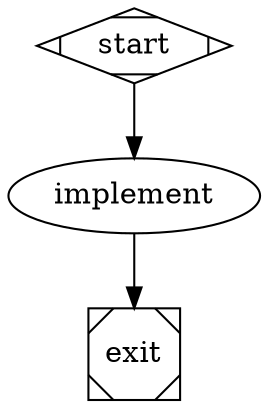

# The Fabro dialect, as lowered

Petri runs Fabro workflows: Graphviz DOT files (`*.fabro`, `*.dot`) in the
subset Fabro accepts. This page says what each Fabro construct becomes in the
engine's IR, and what is refused. Fabro's own documentation defines the
language; `.ai/plans/done/fabro-frontend-phase-one.md` records the decisions.
The reference Fabro revision, the required workflow bundles, the feature
matrix, and the accepted differences are frozen in
[`crates/fabro/acceptance/CONTRACT.md`](acceptance/CONTRACT.md).

The rule throughout: **every construct lowers onto what the core has**. No
engine semantics were added for Fabro. A construct that cannot lower is a
specific `unsupported.*` rejection, never a silent approximation.

## Run creation happens at load

Fabro renders templates, resolves `@file` references and applies its model
stylesheet once, when a run is created, and persists the literal graph. The
frontend does the same at load, so `petri check --print-graph` shows the graph
a run will execute.

| Fabro | At load |
|---|---|
| `{{ inputs.* }}`, `{{ vars.* }}`, `{{ goal }}` in the goal and prompts | rendered with MiniJinja, strict: an unbound name is `unsupported.template.unbound_input` with the `--input KEY=VALUE` hint. `petri check` given no inputs at all downgrades it to the warning `fabro.unbound_input` and leaves the text unrendered, so a file validates before its inputs exist; a run is always strict |
| the same tokens in a `script` | Fabro's token interpolation: each token is one shell-quoted word |
| `[run.inputs]` in `workflow.toml` beside the file | input defaults, under the host's `--input` / `--inputs-file` |
| `[run] goal` (text or `{ file }`) | the run goal when the graph sets no `goal` (the graph attribute wins, as in Fabro) |
| `[run.model]` `provider`, `name`, `controls.reasoning_effort` | the model, provider and reasoning effort an agent or prompt node gets when neither it nor the graph (`default_model`, `default_provider`) names one. `controls.speed` and `[run.model.fallbacks]` warn (readiness item 9a) |
| `[run.execution]` `mode`, `approval` | launch defaults in `Graph.params["fabro.launch"]`: `mode = "dry_run"` runs the stub registry, `approval = "auto"` answers every question with its first choice. `--dry-run`, `--auto-approve`, `--interactive` and `--interview-script` win |
| `[run.environment]` `id` over `[environments.<id>]` | `provider` selects the sandbox backend when `--backend` is not given: `local` is the host, `docker` the Docker plugin, `daytona` the Daytona plugin. `image.docker` becomes the scope's container image under `docker` and `daytona`. `env` is the scope environment; a value that is exactly `{{ secrets.NAME }}` is a `$secret` reference every command resolves at spawn (the standalone runner reads `PETRI_SECRET_NAME`; a missing secret fails the command with `secret_unavailable`) and masks in every log. `resources` size a Daytona runner. `cwd`, `network`, `lifecycle`, `labels` and `image.dockerfile` are platform-only and warn `ignored.workflow_toml.environments.<id>.<key>`; an `id` with no table, or a provider outside the three, is an error |
| `[run.prepare]` `steps`, `timeout` | setup steps lowered as command nodes `run_prepare_1`, `run_prepare_2`, ... between `start` and its successors, so they run in the selected environment before any node, in order, each with the section's `timeout` (default `5m`), its `env`, and `on_failure="exit"`: a failed step ends the run before the first node. `command` argv is joined with shell quoting; `script` runs as written; `{{ inputs.* }}`, `{{ vars.* }}` and `{{ goal }}` render at load. The whole file is validated before any step runs |
| other sections in `workflow.toml` | every section is diagnosed, none is dropped silently. Platform-only sections warn `ignored.workflow_toml.<section>` with why (`[run.working_dir]`, `[run.metadata]`, `[run.model.fallbacks]`, `[run.clone]`, `[run.run_branch]`, `[run.meta_branch]`, `[run.pull_request]`, `[run.git]`, `[run.integrations]`, `[run.checkpoint]`, `[run.artifacts]`, `[run.notifications]`, `[run.interviews]`, `[run.scm]`, `[run.agent] fabro_tools`, and the top-level `[project]`, `[cli]`, `[server]`, `[llm]`). A requirement the standalone runner cannot meet is an error: `unsupported.workflow_toml.run.hooks` (a configured hook is never skipped silently), `unsupported.workflow_toml.run.agent.mcps`. A key Fabro's parser refuses (a legacy top-level key, an unknown `[run]` key, `_version` other than 1) is `unsupported.workflow_toml.key` / `unsupported.workflow_toml.version` with Fabro's rename hint. See `crates/fabro/acceptance/CONTRACT.md` for the per-option table |
| `prompt="@prompts/x.md"`, `output_schema="@schemas/x.json"` | read beside the workflow file; `` resolves beside the included file |
| `model_stylesheet` | rendered, parsed (`*`, shape, `.class`, `#id`; specificity 0–3), written onto nodes; an explicit node attribute wins |
| `import="<path>"` | expanded at load as Fabro's import transform expands it (below); the persisted graph carries the imported nodes |

Inputs, vars and the rendered goal land in `Graph.params` (`inputs`, `vars`,
`goal`), so the persisted graph is self-describing for replay. The launch
settings `workflow.toml` declared land in `Graph.params["fabro.launch"]`
(`sandbox_backend`, `dry_run`, `auto_approve`, the Daytona sizes) and the
resolved environment in `Graph.params["fabro.environment"]`; the CLI reads
them back through `Frontend::launch_settings` when it starts the run.

## Imports

A node with `import="<path>"` is a placeholder for another workflow file,
resolved relative to the importing file. The imported file's nodes are
spliced in under the placeholder's id as a prefix (`<placeholder>.<node>`);
its start and exit sentinels (`Mdiamond`/`Msquare`, or the ids `start`,
`exit`, `end`) are dropped; the placeholder's incoming edges reach the
imported entry node and its outgoing edges leave the imported exit
predecessor, both with their attributes. The placeholder may carry only
`import`, `class`, and the inheritable defaults `model`, `provider`,
`reasoning_effort`, `speed`, `backend`, `acp.command`, `acp.config`,
`fidelity`, `max_retries`, `thread_id`; each default lands on every imported
node that does not set it. The placeholder's classes and a class made from its
id (lowercase, spaces to `-`, `[a-z0-9-]` only) propagate to every imported
node. `retry_target` and `fallback_retry_target` inside the import are rewritten
to the prefixed ids; `@file` references inside it resolve beside the imported
file. Imports nest, each relative to its own file; a cycle is refused.

Fabro's boundary rules apply and every failure is `fabro.import` on the
placeholder with Fabro's message: exactly one start and one exit; no edge into
start or out of exit; exactly one successor of start and one predecessor of
exit, neither edge carrying `condition`, `label`, `weight`, `fidelity`,
`thread_id`, `loop_restart` or `freeform`; an empty import (start to exit
only) is removed and its neighbours wired directly, but not across a semantic
edge; a placeholder with any other attribute, a self-loop, or a prefixed id
that already exists is refused. An imported `model_stylesheet` is ignored with
a warning; the importing workflow's stylesheet governs.

## Nodes

| Shape / type | Petri node | Step config |
|---|---|---|
| `Mdiamond` start | `noop`, the entry | |
| `Msquare` exit | `noop`; `Completion::TerminalNode(exit)` | |
| `diamond` conditional | `noop` | |
| `box` agent | `fabro/agent` | prompt, goal, fidelity, `backend`, model settings, `output_schema`, `output_retries`, `acp` |
| `tab` prompt | `fabro/prompt` | prompt, goal, fidelity, model settings, `output_schema`, `output_retries`; API-only: `backend="acp"` on the node is `fabro.prompt_backend`, and the graph's ACP settings never reach it |
| `parallelogram` command, or any node with `script` | `fabro/command` | script, language, `stdin` (an expression over `kv`), `output_schema`, `env` (`[run.prepare]` step env and the environment's `$secret` values) |
| `hexagon` human | `fabro/human` | the choices (from the edges), `question_type`, `freeform_target`, `sensitive` |
| `component` parallel | `noop` with one routing group per branch, or a `for_each` expansion (below) | |
| `tripleoctagon` fan-in | `noop`, `join: all`; its output is the ordered branch results | |
| `tripleoctagon` fan-in with a `prompt` | `fabro/prompt`, `join: all`: the ordered barrier, then one model call over the branch results (`sources`, `branch_results`) | |
| `insulator` wait | `fabro/wait` | `duration_ms` |
| `house` manager loop | `fabro/workflow` | the child graph's digest, `manager.*` |
| `circle`, `doublecircle`, other shapes | `fabro/agent`, with a `fabro.unknown_shape` warning | |

Every node's `meta` carries `label`, `shape`, `kind`, `classes`, `span`, and
`model` / `provider` / `reasoning_effort` when set. Every step config carries
`kv` (the run context at spawn) and `on_failure`; a node whose `on_failure` is
`succeed` or `partially_succeed` also carries `routes`, its explicit routes
(condition texts, label keys, unconditional targets) for the promotion check
below.

Timeouts: `timeout` is the per-attempt `Budget.timeout`. Without one, a
command gets 600 s (Fabro's default), an agent 24 h, a human gate 30 days, a
wait its duration plus an hour. A bare number (`timeout=1200`) is the
Attractor spelling and is refused; write the unit.

Retries: `max_retries` (default `default_max_retries`, default 0) or a
`retry_policy` preset (`none`, `standard`, `aggressive`, `linear`, `patient`)
becomes `RetryPolicy`. Only a failure the step classed `retry_requested` is
retried: Fabro's retry intent is a flag on the outcome, never a status.
`allow_partial=true` — Fabro's spelling of `on_retries_exhausted="partially_succeed"` —
is `Exhaustion::AcceptPartial`.

## Routing

Each node's outgoing edges become one routing group with `SelectionPolicy::Tiered`
and Fabro's four tiers, `Fallthrough::NoEmit` (no match is a normal end):

| Tier | Candidates | `when` | pick |
|---|---|---|---|
| 1 | edges with a `condition` | the lowered condition | `selection`: `HighestWeightThenLexical` (default) or `WeightedRandom` |
| 2 | unconditional edges with a `label` | `normalize_label(output.preferred_label) == "<label key>"` | `First` |
| 3 | unconditional edges | `index_of(output.suggested_next_ids, "<target>") != null`, ranked by that index | `LowestRankThenArmOrder` |
| 4 | unconditional edges | the failure policy (below) | `selection` |

Weights are Fabro's: highest wins, ties break on the lexical target id, and a
negative `weight` deprioritizes an edge. The engine's weights are unsigned, so a
node with a negative weight has every weight shifted up until the lowest is
zero (order and ties unchanged). Under `selection="random"` a weight at or below
zero counts as one, as Fabro counts it.

Labels: the accelerator prefix (`[Y] Yes`, `Y) Yes`, `Y - Yes`) is stripped on
both sides before the engine's `normalize_label`. `selection="random"` with a
conditional edge is `fabro.random_with_conditions`, as in Fabro. `loop_restart=true`
is `EdgeTransition::Restart`: the execution ends and a successor starts at the
target with empty context.

### Conditions

| Fabro | Petri expression |
|---|---|
| `outcome=succeeded` / `partially_succeeded` / `skipped` | `status == 'success'` / `'partial_success'` / `'skipped'` |
| `outcome=failed` | `failure() || cancelled() || timed_out()` |
| `outcome=success` | read as `outcome=succeeded` with the warning `deprecated.outcome_alias`, until 2026-10-04 (Fabro itself never matches it) |
| `outcome=<anything else>` | `unsupported.outcome_value`: domain signals ride `context_updates` |
| `preferred_label=X` | `to_string(default(output.preferred_label, '')) == 'X'` |
| `context.K=X`, bare `K=X` | `to_string(default(get(kv, 'K'), '')) == 'X'` — Fabro's text comparison |
| `K` (bare) | non-empty, not `"false"`, not `"0"` |
| `K > 5` and friends | both sides numeric, else false (`loose_*` builtins) |
| `K contains X` | array element equality, else substring |
| `K matches re` | `matches(...)`; the pattern is validated at load |

### Failure policy

Two attributes, one value set — Fabro's `route`, `exit`, `succeed`, plus
Petri's `partially_succeed` — and the specific one wins:

- `on_failure` decides a non-retryable failure; `on_retries_exhausted` decides a
  retryable one that ran out of attempts (`allow_partial=true` spells the latter's
  `partially_succeed`).
- `route`: the unconditional edge is taken. `exit`: it is guarded `!failed`, so
  the run quiesces and fails under `TerminalNode`.
- `succeed` promotes a failure the way Fabro's executor does. The step first
  checks the node's explicit routes against the failed outcome and the
  prospective context (the run context with the stage's own updates applied):
  a conditional edge whose condition holds, a preferred label naming a
  labelled edge, or a suggested target naming an edge. A failure an explicit
  route matches stays a failure and routing takes that route. Any other
  non-retryable failure is promoted: the record is a `PartialSuccess` with the
  failure kept in `underlying`, `output.promoted` says so, the reported
  `output.outcome` is `succeeded`, and the node's `outcome=succeeded`
  conditions match it while `outcome=partially_succeeded` does not, as Fabro
  shows its conditions. The event log never records a clean success for a
  failed step. `auto_status=true` is the deprecated spelling
  (`deprecated.auto_status`, Fabro's `auto_status_deprecated` rule) and is
  ignored when `on_failure` is set.
- `partially_succeed` is a Petri extension (`fabro.petri_extension` names it):
  the same promotion check and the same `PartialSuccess` record, but the
  reported outcome is `partially_succeeded`, so `outcome=partially_succeeded`
  conditions match the promoted stage. Fabro's validator refuses the spelling
  (`on_failure_valid` accepts `route`, `exit`, `succeed`), so a workflow that
  uses it runs on Petri only; the oracle case
  `partially_succeed_policy_classifies_before_routing` records that
  rejection beside Petri's result, and `crates/fabro/acceptance/CONTRACT.md`
  lists the spelling under accepted differences.
- A retryable failure is never promoted by the step: the engine retries it,
  and `allow_partial` / `on_retries_exhausted="partially_succeed"` accept the
  last failure as a partial success on exhaustion (`Exhaustion::AcceptPartial`).
- A human gate never falls through on failure, whatever the policy.

### Goal gates and loops

`goal_gate=true` nodes lower to a `goal_check` noop in front of `exit`: for each
gate (in id order) an arm guarded by `!default(nodes.<gate>.success_like, false)`
jumps back to the first existing retry target of the node's `retry_target`, its
`fallback_retry_target`, the graph's, the graph's fallback; a gate with no target
ends the run failed; the last arm reaches `exit` when every gate passed.

A depth-first search from start marks every cycle-closing edge `back`; every
node forward-reachable from a back edge's target gets a finite
`Budget.max_firings`: `max_visits`, else `max_node_visits`, else 500 (Fabro's
unlimited, with one `info.budget.default` note). A value above 500 is refused.
Every node except a fan-in joins with `Any`.

## Parallel

A `component` node without `for_each` fans out with one routing group per
branch; every branch's edge into the `tripleoctagon` carries
`{ index, value: { id, status, output } }`, and the fan-in's output is those
values in branch order. `for_each="context.K"` makes the component evaluate
`get(kv, 'K')` (its precondition enforces Fabro's 1000-item cap) and marks the
single template node — an agent or prompt — with `Expansion::ForEach` over its
input, `max_parallel` carried, `fail_fast: false`. Branch results ride tokens;
`stdin_source="context.parallel.results"` on a later command reads the nearest
fan-in's output.

## Nested workflows

`stack.child_workflow` (a path; `fabro/…` stands for `.fabro/…`) or
`stack.child_dot_source` (inline DOT) is lowered with the parent, to at most
three levels, with cycles refused. The child graph is registered before the
run starts. The `fabro/workflow` step follows Fabro's manager loop: it starts
the child once per manager attempt, at one durable call site (the node id), so
a re-dispatch of the same attempt after a crash reattaches to the child it
declared instead of starting another; a later attempt starts a fresh child.
It then polls: every `manager.poll_interval` (45 seconds when unset) it
evaluates `manager.stop_condition` against the parent's public context with a
reference success outcome (`outcome=succeeded`, no preferred label). A
satisfied condition cancels the child and the node succeeds with no context
updates; `manager.max_cycles` polls without child completion cancel the child
and fail the node (`max_cycles`). A child that completes first returns its
status, its failure (message and class) when it failed, and every public key
it changed (`internal.*`, `graph.*`, `thread.*` and `current*` keys excluded).
`manager.max_cycles` normalizes as Fabro does: missing, non-integer or negative
is 1000 (a warning names the bad value), zero is 1. A 1,000-poll manager
consumes one child invocation. The child inherits the parent's sandbox and
secrets; the parent's cancel cancels it. A host that runs Fabro steps outside
the coordinator registers `fabro_steps::workflow::ChildInvoker`.

## Steps at run time

- **`fabro/command`** runs the script in bash (`language="python"`: `python3 -c`)
  with stderr merged, with the config's `env` (secret references resolved at
  spawn), feeds `stdin_source` through the process's stdin (an output
  reference is read back through the store first), records the output in
  `output.stdout` and `command.output`, and with `output_schema="routing"`
  reads the last JSON object of the output as the routing directive
  (`outcome`, `preferred_next_label`, `suggested_next_ids`, `context_updates`,
  `failure_reason`). Output above 100 KiB leaves the record for the output
  store (below); the in-memory cap is 8 MiB.
- **`fabro/prompt`** is one model call through the application's `lithos-llm`
  client (the `PebbleClient` capability), with no tools and no coding-agent
  loop: the goal, the compact preamble of earlier stages, the branch results
  for a prompted fan-in, the node's prompt and the output contract, as one
  user message. `model` (or `default_model`, or `[run.model] name`) is
  required; `provider` qualifies it; `reasoning_effort` rides the request; a
  JSON response format is requested when the catalog row offers it. A
  response that misses the contract gets a repair turn (the failed reply and
  the repair message appended), up to `output_retries` times (default 2), then
  fails `bad_output`. The result writes `response.<node>`, `last_response`
  (the first 200 characters), `last_stage`, then the routing fields or
  `output.<node>`. Two `StepEvent::Custom` payloads carry what a host maps
  onto Fabro's `stage.prompt` and `prompt.completed`: `kind = "fabro.prompt"`
  (`node`, `firing`, `attempt`, `model`, `prompt`, `sources`) before the first
  call, and `kind = "fabro.prompt.completed"` (`node`, `firing`, `attempt`,
  `model`, `outcome`, `response`, `calls`, `repairs`, `usage`,
  `cost_usd_micros`, `duration_ms`) after the last. Metrics: `prompt.calls`,
  `prompt.usage`, `prompt.cost_usd_micros`.
- **`fabro/agent`** assembles the prompt from the goal, earlier stages, and the
  node's prompt. Both backends share routing, `output_schema` validation,
  `output_retries` repair turns, and steering deliveries. Each attempt starts a
  fresh agent session. Repair turns keep that session's history.
  `backend="acp"` is the default. It starts the Agent Client Protocol command
  from `acp.command` / `acp.config` (node, graph, then `PETRI_ACP_COMMAND`). The
  ACP command owns model selection; model settings are observer metadata.
  `backend="api"` runs the Pebble Rust library in Petri. `model` (or graph
  `default_model`) is required. `provider` (or `default_provider`) qualifies the
  model selector, and `reasoning_effort` configures the actual model request.
  The node's backend overrides the graph's backend; model stylesheets can also
  select it. Graph ACP configuration applies only to ACP nodes. Setting ACP
  options directly on an API node is an error.
- **`fabro/human`** asks through the core `Question` event and routes on the
  delivered answer. The host's interviewer answers: `petri run --interactive`
  from the terminal, `--auto-approve` with the first choice,
  `--interview-script <file>` from a script (see the README's terminal path
  section). A `question_type="multi_select"` answer names several choices;
  the first routes, and `human.gate.selected` / `human.gate.label` record every
  selected key and label joined by `,` and `, `, as Fabro does. A
  `sensitive=true` gate's free text crosses as a `$secret` reference, which is
  a Petri extension. An answer marked `cancelled` (the interviewer failed, or
  the wait was cancelled) fails the gate closed with class `interrupted`.
- **`fabro/wait`** sleeps, cancel-aware.
- **`fabro/workflow`** is the nested invocation above.
- **Output references.** A stage value whose serialized form is above 100 KiB
  (Fabro's offload threshold; a scalar never, a string by its JSON size) does
  not stay inline in the context or the event log. The step writes it to the
  run's output store and records `blob://sha256/<hex>` in its place (a
  structured value carries a `#json` suffix so it parses back). `stdin_source`,
  a prompted fan-in's branch results, and the agent and prompt steps' own
  updates read the logical value back through the store; a route or a
  condition that reads such a key sees the reference text, as Fabro's edge
  selection does for every key but `command.output`. The store is the
  `fabro_steps::OutputStore` capability: `fabro_steps::register` installs a
  `LocalBlobStore` under `<run_dir>/blobs` unless the host registered its own
  before the run, so a Fabro host replaces it with platform storage without
  changing node semantics. The store is content addressed, so a resumed run
  reads the same references.
- **`petri run --dry-run`** is the stub registry: every stage succeeds, a human
  gate takes its first choice, as Fabro's `--dry-run` does.

## Native Pebble

The `petri` distribution supplies a lithos-llm client with the built-in model
catalog and environment credentials, such as `ANTHROPIC_API_KEY` or
`OPENAI_API_KEY`. It enables Anthropic, OpenAI, Gemini, and OpenAI-compatible
adapters. Applications that use `fabro_steps::register` directly must provide
`fabro_steps::pebble::PebbleClient(client)` through `Runtime::capability`.
The application owns the client's catalog, credentials, and retry middleware.

Tools use the firing's `ExecEnv`. Commands run as `bash -c` inside the scope;
files use the scope's filesystem. Bash, find, grep, and the usual file utilities
must be available there. Content search uses ripgrep when available and grep
otherwise. Searches fail explicitly when their captured output exceeds 4 MiB.
The backend reads workspace `AGENTS.md` and discovers workspace skills in
`.agents/skills` and `.pebble/skills`. Tools have full access within the scope's
policy. Petri's sandbox owns process isolation. This integration does not
install interactive approvals or subagents. Tool output is bounded by Pebble's
capture and preview limits. Omitted bytes are discarded and cannot be retrieved.

`Control::Deliver` accepts a string or `{ "text": "..." }` and queues a
follow-up. A delivered core `Answer` naming one of the session's open
questions answers it instead (below). Cancellation settles the active prompt
and shuts down its session.
Kill stops active tool processes immediately. A driver hard abort can discard
an unsettled prompt report; scope release remains responsible for cleanup.

Pebble events appear as `StepEvent::Custom` with `kind="pebble"`, firing,
attempt, scope, node, and the original event envelope. The envelope preserves
stream sequence, session, parent session, and tool-call identifiers. Petri's
secret masker applies before forwarding. These events use Petri's existing
log pipeline; the integration does not checkpoint or resume Pebble sessions.

The session's question tool (`request_user_input` for GPT-5.6 and GPT-6,
`AskUserQuestion` for Claude) reaches the same interviewer a human gate does.
Petri implements Pebble's `HumanInputProvider`: each question in a batch
becomes a core `Question` on the step's progress channel, with id
`<node>#<firing>/agent/<session>/<tool call>/<index>`, `kind`
`multiple_choice` or `multi_select`, the harness's `option_N` keys, and
`freeform` set as Pebble allows. The delivered answer's choices (or free
text) go back to Pebble as that question's answers; a cancelled answer or a
cancelled prompt goes back as `cancelled`. The interview receipt records
these questions beside the workflow's own gates.

Attempt metrics include `pebble.prompts`, `pebble.usage` (five disjoint token
buckets), `pebble.cost_usd_micros`, `pebble.inference_ms`, and `pebble.tool_ms`.
They sum all settled prompt reports, including repair turns, failed prompts,
and cancellation. Cost is a known subtotal: null means no response reported a
cost. These metrics exclude compaction and model calls made inside tools.
ACP continues to report `acp.turns`.

## Refused

| Construct | Code |
|---|---|
| `outcome=X` for X outside the four outcomes (and, after 2026-10-04, `success`) | `unsupported.outcome_value` |
| `llm_prompt`, `is_codergen`, `node_type`, bare-number timeouts | `unsupported.attractor` |
| an `import` Fabro's transform would refuse (missing file, bad boundary, cycle, extra placeholder attribute) | `fabro.import` |
| `backend="acp"` on a `tab` prompt node | `fabro.prompt_backend` |
| `acp_command` (legacy) | `unsupported.acp_command` |
| an unbound `{{ inputs.* }}` (a warning, `fabro.unbound_input`, under `petri check` with no inputs) | `unsupported.template.unbound_input` |
| ports, HTML strings, undirected graphs, `strict`, anonymous subgraphs | `unsupported.dot.*` |

**Accepted until 2026-10-04.** One spelling is a dated shim, with a warning
that names the date and a `REMOVE AFTER 2026-10-04` comment at every site
(`grep -r "REMOVE AFTER"`): `outcome=success` in a condition (see
"Conditions"). Fabro accepts that spelling but it never matches, so Petri's
later rejection is deliberately stricter. `on_failure="succeed"` and
`auto_status` are supported for as long as the reference Fabro supports them
(see "Failure policy"); their earlier sunset was withdrawn by the readiness
plan. `.ai/plans/done/fabro-local-workflows.md` lists the workflows that
depend on the alias and what to do at the sunset.

Ignored loudly (a warning naming the attribute): `stall_timeout` and
`loop_restart_signature_limit` (host policy, later phases), `tool_hooks.*`, and
any attribute Fabro does not define. Graphviz layout attributes are dropped
silently.

## Syntax both runners reject, and Petri's stricter diagnostics

Rejected by both: Attractor attributes (`unsupported.attractor`), a bare-number
`timeout`, an `outcome=` value outside the four outcomes
(`unsupported.outcome_value`), the legacy `acp_command`, an import Fabro's
transform refuses (`fabro.import`), `backend="acp"` on a prompt node, a human
gate with no edges, a `for_each` template that is not an LLM node, structural
mistakes (no start, no exit, unreachable nodes), and the `workflow.toml` keys
Fabro's parser refuses (`unsupported.workflow_toml.key`).

Petri-stricter, tested as differences and listed in
`crates/fabro/acceptance/CONTRACT.md`: the 500-firing cap and its
`fabro.max_visits_too_large` / `info.budget.default` diagnostics (Fabro is
unlimited), `outcome=success` after its sunset, the 10,000-invocation maximum,
`image.dockerfile` and the other platform-only `workflow.toml` warnings, and
`on_failure="partially_succeed"` in the other direction: Petri accepts a
spelling Fabro refuses.
